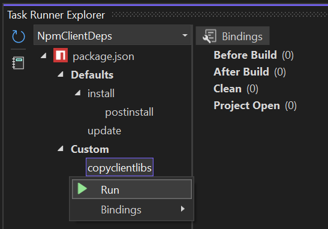

# Managing client libraries in ASP.NET Core projects

## What is this?

Examples of different techniques for adding management of client libraries (i.e. JS/CSS libraries/frameworks) to ASP.NET Core projects. The default ASP.NET Core project templates include a number of client libraries (e.g. Bootstrap, jQuery) but the files are simply included in the *wwwroot* directory. There is no client library package manager configured to easily enable updating these libraries to new versions, etc. In early versions of ASP.NET Core we included configuration for using the now deprecated [Bower](https://bower.io/), along with [Grunt](https://gruntjs.com/) and then [Gulp](https://gulpjs.com/), but we removed it all (before 1.0?).

## Pre-requisites

- .NET 7.0.100 (or greater) SDK ([download here](https://dotnet.microsoft.com/download/dotnet/7.0))

## Details

There are four different projects in this repository, each demonstrating a different technique for managing client libraries. Each of these projects is based on the default ASP.NET Core web application project template (i.e. `dotnet new webapp`) and use Razor Pages to render HTML from the server, and include the following client libraries to enable various aspects of the site:

- Bootstrap
- jQuery
- jQuery Validation
- jQuery Validation Unobtrusive

The files for these libraries are served from */wwwroot/lib* and statically referenced from the */Pages/Shared/_Layout.cshtml* file.

In addition to these libraries, the site contains:

- A */wwwroot/site.js* file where project-specific JavaScript is intended to go
- A */wwwroot/site.css* file where project-specific CSS is intended to go
- A */Pages/Shared/_Layout.cshtml.css* where CSS for the *_Layout.cshtml* Razor layout page is intended to go

The first two files are served as simple static files from the site's *wwwroot* directory. The last file is an example of using [Razor Pages CSS isolation](https://learn.microsoft.com/aspnet/core/razor-pages/?view=aspnetcore-7.0&tabs=visual-studio#css-isolation). The files are statically referenced from the */Pages/Shared/_Layout.cshtml* file.

### Example 1: NoClientDepsMgmt

The [NoClientDepsMgmt](./NoClientDepsMgmt) project represents the default result of creating a new ASP.NET Core web application today (i.e. `dotnet new webapp`). The client library files are simply included in the project contents on disk. There is no package manager or other mechanism configured to manage these libraries, so updating to a new version is completely manual process that involves downloading the new version of the library from somewhere and copying it over the existing files. Depending on where the new version was downloaded from, this might also require renaming the files to remove the version.

Pros:

- Client library files already in the project after creation (no extra restore required)
- No dependencies on any extra tools

Cons:

- Updating client libraries to new versions is cumbersome
- Adding any other client libraries is cumbersome
- No smooth path to adding any client asset build tools, e.g. webpack

### Example 2:  LibMan

The [LibMan](./LibMan) project adds configuration for the [LibMan](https://learn.microsoft.com/aspnet/core/client-side/libman) tool, which can be used to manage client libraries via a CLI tool or in Visual Studio. The tool is created and maintained by Microsoft. The configuration is stored in a *libman.json* file in the project root.

Pros:

- Client library files already in the project after creation (no extra restore required)
- Simple to update client libraries to new versions
- Simple to add new client libraries

Cons:

- CLI tool must be installed
- Visual Studio experience has some discoverability and usability issues
- Only supports acquiring client libraries from CDNs (although that includes [unpkg](https://unpkg.com/#/) which hosts the contents of all packages on npm)
- No smooth path to adding any client asset build tools, e.g. webpack

### Example 3: NpmClientDeps

The [NpmClientDeps](./NpmClientDeps) project adds configuration for [npm](https://www.npmjs.com/). The configuration lists the client libraries as npm dependencies for the project and specifies a custom [npm script](https://docs.npmjs.com/cli/v6/using-npm/scripts) that when invoked, copies the client library files to the required location in the project's *wwwroot* directory.

The custom script is also configured to automatically run anytime `npm install` is run. Thus, if a client library needs to be updated or a new client library installed, doing so via the usual npm mechanisms will result in the client library files being copied to where they need to be in the project's *wwwroot* directory.

The script itself is a JavaScript file in the project at */build/copy-client-libs.js*. The script can be executed manually from the command line using the npm CLI like so:

```shell
NpmClientDeps> npm run copyclientlibs
```

It can also be executed manually from Visual Studio using the Task Runner Explorer window but only if the [NPM Task Runner extension](https://github.com/madskristensen/NpmTaskRunner) is installed.



Pros:

- Client library files can already be in the project after creation without npm install being run, they simply need to be included in the template as they are today
- Simple to update client libraries to new versions via npm
- Simple to add new client libraries via npm
- Client library files automatically copied to project when updated or added via npm
- Simple to add other client asset build tools from the npm ecosystem, e.g. webpack
- "Lights up" simple support for using the npm ecosystem in ASP.NET Core projects
- npm configuration file & custom script can be easily deleted from project if undesired

Cons:

- Requires NodeJS/npm to update or add client libraries
- Visual Studio experience for npm is in an optional workload (Node Tools) and has some usability issues, e.g. npm node doesn't always appear in dependencies node of Solution Explorer
- Doesn't integrate with the project's natural build system (MSBuild) so npm operations must be manually configured

### Example 4: NpmClientDeps.ClientAssets

The [NpmClientDeps.ClientAssets](./NpmClientDeps.ClientAssets) project expands on the NpmClientDeps project by utilizing the experimental [Microsoft.AspNetCore.ClientAssets](https://www.nuget.org/packages/Microsoft.AspNetCore.ClientAssets) package to link the npm scripts-based client assets build pipeline with the MSBuild.

In this project, the source files for the client assets build pipeline are in the [assets](./NpmClientDeps.ClientAssets/assets/) sub-directory, including the npm *package.json* file and *copy-client-libs.js* script. The key difference is that the script is automatically run as part of the project's regular MSBuild-based build. The [Microsoft.AspNetCore.ClientAssets](https://www.nuget.org/packages/Microsoft.AspNetCore.ClientAssets) package properly tracks inputs and outputs of the npm-based build process to ensure properly incrementality (i.e. the npm script is only invoked when its inputs change, thus avoiding incurring that cost on every build). See [this blog post](https://devblogs.microsoft.com/dotnet/build-client-web-assets-for-your-razor-class-library/) for more details on how the *Microsoft.AspNetCore.ClientAssets* works.

This approach shows promise but required some extra effort to make it work well:

The content of the *assets* directory is still included in the application output by default but likely shouldn't be, as it's not required at runtime. Additionally, the files produced by the npm build pipeline (in this case, our client library files), are not correctly served during development (i.e. when launching from Visual Studio/`dotnet run`), as they're not actually copied to the *wwwroot* directory, but rather added as linked files (they **are** copied to the publish output correctly). The fix these issues, updates to the project file were made (see below) along with code to add the client assets intermediate output directory to the `WebRootFileProvider`. Both of these should likely be done by default when using the package:

*NpmClientDeps.ClientAssets.csproj*:

```xml
<ItemGroup>
    <!-- Files in assets shouldn't be included in build or publish output -->
    <Content Update="assets/**/*.*" CopyToOutputDirectory="Never" CopyToPublishDirectory="Never" />
    <AssemblyAttribute Include="System.Reflection.AssemblyMetadataAttribute" Condition="'$(IntermediateOutputPath)' != ''">
    <_Parameter1>ClientAssetsDirectory</_Parameter1>
    <_Parameter2>$(IntermediateOutputPath)clientassets/</_Parameter2>
    </AssemblyAttribute>
</ItemGroup>
```

*Program.cs*:

```csharp
if (builder.Environment.IsDevelopment())
{
    builder.WebHost.UseClientAssets();
}
```

*ClientAssetsExtensions.cs*:

```csharp
public static class ClientAssetsExtensions
{
    private const string ClientAssetsDirectoryKey = "ClientAssetsDirectory";

    /// <summary>
    /// Configures the <see cref="IWebHostEnvironment.WebRootFileProvider"/> to use client assets from the intermediate output
    /// directory built by npm.
    /// </summary>
    /// <param name="builder">The <see cref="IWebHostBuilder"/>.</param>
    public static void UseClientAssets(this IWebHostBuilder builder)
    {
        builder.ConfigureAppConfiguration((context, configBuilder) =>
        {
            // Enable serving static files from the Microsoft.AspNetCore.ClientAssets intermedite output dir
            var webHostEnvironment = context.HostingEnvironment;
            var infoVerAttr = typeof(Program).Assembly.GetCustomAttributes<AssemblyMetadataAttribute>()
                .FirstOrDefault(a => string.Equals(a.Key, ClientAssetsDirectoryKey, StringComparison.OrdinalIgnoreCase));
            if (infoVerAttr is not null && Directory.Exists(infoVerAttr.Value))
            {
                var clientAssetsOutputDir = new PhysicalFileProvider(Path.Combine(webHostEnvironment.ContentRootPath, infoVerAttr.Value));
                webHostEnvironment.WebRootFileProvider = new CompositeFileProvider(new[] { clientAssetsOutputDir, webHostEnvironment.WebRootFileProvider });
            }
        });
    }
}
```

The linked *wwwroot* files **are** actually included in the project's **staticwebassets.runtime.json** file when built, but they're mapped to the wrong content root directory (the scoped CSS bundle output directory). This results in them not being able to be served by the static web assets mechanism that is enabled by default and is likely what should actually be made to work when this package is productized.

Visual Studio doesn't show the linked *wwwroot* files at design-time in the Solution Explorer which is a bit confusing too. Statically linked files are usually shown fine though so this is likely something that could be fixed in Visual Studio.

This approach precludes including the client library files in the project template, as once the npm build has been run, the linked file items will clash with the physical files in the same logical location. It's possible this could be resolved by updating the *ClientAssets* build targets to be resilient to npm not being available and the files to be linked already existing in the *wwwroot* directory, e.g. it could first delete them before linking the new files.

Pros:

- Simple to update client libraries to new versions via npm
- Simple to add new client libraries via npm
- Client library files automatically copied to project output when published
- Simple to add other client asset build tools from the npm ecosystem, e.g. webpack, and have them contribute to the project output
- Provides proper build integration for using the npm ecosystem in ASP.NET Core projects
- npm configuration file & custom script can be easily deleted from project if undesired

Cons:

- Requires NodeJS/npm to get the client library files after project creation (possibly fixable, see notes above)
- Requires NodeJS/npm to update or add client libraries
- Visual Studio experience for npm is in an optional workload (Node Tools) and has some usability issues, e.g. the npm files are in a sub-directory of the project and thus the Visual Studio npm tooling doesn't seem to see them and activate itself, e.g. npm dependencies node in Solution Explorer
